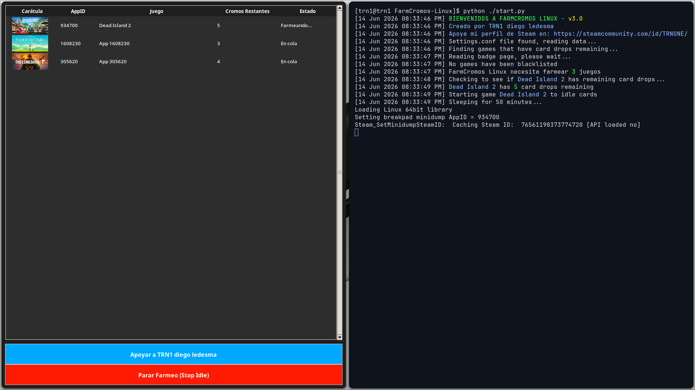

<div align="center">
  
  <br><br>
  
</div>

# FarmCromos Linux (v3.0.0)
🌎 [English](#english) | 🇦🇷 [Español](#español)

---

<a name="english"></a>
# 🌎 English

This project is a Steam card idler for Linux. It allows you to farm trading cards automatically from your Steam games without having them installed or open, saving system resources.

## How it works

The project uses the official Steam API (`libsteam_api.so`) to tell the Steam client that the games are running.
The main script (`start.py`) works as a manager that automatically checks your Steam badges page for available card drops. It then launches and manages instances of the secondary script (`steam-idle.py`) in the background. **It features a unified responsive dark-mode GUI that displays the covers of all your farmed games in a single window.**

> **Note:** The `steam-idle.py` file is **strictly necessary**, as it is responsible for communicating directly with the Steam API. It runs in "headless" mode without cluttering your desktop with multiple windows.

> [!IMPORTANT]
> **Security Notice:** This application **DOES NOT collect, read, or store** any personal information, passwords, or data from your Steam client. Your account is completely safe. The script works solely and exclusively by communicating with the official API to "simulate" that the game is open to farm cards.

> [!TIP]
> **🌟 Support the Project:** This software is **100% free**! If it has been useful to you and you feel like supporting my work, any small gesture is more than welcome (whether it's some Steam Points on my profile, leaving a "+rep" comment so I can feel your support, or even a game if you're feeling generous). It is truly appreciated from the bottom of my heart, but definitely not required!
> 👉 **[Visit TRN1's Steam profile](https://steamcommunity.com/id/TRNONE/)**

## Requirements

The script needs the following Python packages to work:

* requests
* beautifulsoup4
* pillow (with jpeg and tk support)
* tk (Tkinter)

**Installation example on Arch Linux (via pacman):**
```bash
sudo pacman -S python-beautifulsoup4 python-requests python-pillow tk
```

**Generic installation with pip (other distributions):**
```bash
pip install -r requirements.txt
# (Note: tkinter is usually installed separately from the system package manager, e.g.: sudo apt install python3-tk)
```

## Setup & Usage

> For first time setup, run the script once to generate the `settings.conf` file.

1. Log in to https://steamcommunity.com/ on your web browser.
2. Search your cookies for steamcommunity.com (Firefox users can use Shift-F9).
3. Edit `settings.conf` and copy-paste your `sessionid` and `steamLoginSecure` from your cookie data.
4. Run the main script from the terminal:

```bash
python start.py
```
*(Or `python3 start.py` depending on your system).*

5. The graphical interface will open showing your games and farming status. When you want to stop farming, simply close the window or click the "Stop Idle" button.

## License
This project is licensed under the MIT License - see the [LICENSE](LICENSE) file for details. Created by TRN1 diego ledesma.

---

<a name="español"></a>
# 🇦🇷 Español

Este proyecto es un idler de cromos de Steam para Linux. Te permite obtener cromos automáticamente de tus juegos de Steam sin necesidad de tenerlos instalados ni abiertos, ahorrando recursos del sistema.

## ¿Cómo funciona?

El proyecto utiliza la API oficial de Steam (`libsteam_api.so`) para indicarle al cliente de Steam que los juegos se están ejecutando. 
El script principal (`start.py`) funciona como un administrador que revisa automáticamente tu página de insignias de Steam para encontrar cromos disponibles. Luego lanza y administra instancias del script secundario (`steam-idle.py`) en segundo plano. **Cuenta con una interfaz gráfica unificada y responsiva en modo oscuro que muestra todas las carátulas de los juegos en una sola ventana.**

> **Nota:** El archivo `steam-idle.py` es **estrictamente necesario**, ya que es el encargado de comunicarse directamente con la API de Steam. Este se ejecuta de forma oculta ("headless") para no saturar tu escritorio ni dock con múltiples ventanas.

> [!IMPORTANT]
> **Aclaración de Seguridad:** Esta aplicación **NO recopila, ni lee, ni almacena** ningún tipo de información personal, contraseñas o datos de tu cliente de Steam. Tu cuenta está completamente segura. El script funciona única y exclusivamente comunicándose con la API oficial para "simular" que el juego está abierto y así conseguir los cromos.

> [!TIP]
> **🌟 Apoyo al Proyecto:** ¡Este software es **100% gratuito**! Si te ha sido de utilidad y nace de ti apoyar mi trabajo, cualquier pequeño detalle es más que bienvenido (ya sean unos puntitos de Steam en mi perfil, ir a dejarme un lindo "+rep" en los comentarios para sentir su apoyo, o hasta algún juego si te sientes generoso). ¡Se agradece de todo corazón, pero para nada es obligatorio!
> 👉 **[Visitar perfil de TRN1 en Steam](https://steamcommunity.com/id/TRNONE/)**

## Requisitos

El script necesita los siguientes paquetes de Python para funcionar:

* requests
* beautifulsoup4
* pillow (con soporte para jpeg y tk)
* tk (Tkinter)

**Ejemplo de instalación en Arch Linux (vía pacman):**  
```bash
sudo pacman -S python-beautifulsoup4 python-requests python-pillow tk
```

**Instalación genérica con pip (otras distribuciones):**
```bash
pip install -r requirements.txt
# (Nota: tkinter suele instalarse aparte desde el gestor de paquetes del sistema, ej: sudo apt install python3-tk)
```

## Configuración y Uso

> Para la primera configuración, ejecuta el script una vez para que se genere el archivo `settings.conf`.

1. Inicia sesión en https://steamcommunity.com/ en tu navegador web.
2. Busca tus cookies para steamcommunity.com (en Firefox puedes usar Shift-F9).
3. Edita `settings.conf` y copia-pega tu `sessionid` y `steamLoginSecure` desde los datos de tus cookies.
4. Ejecuta el script principal desde la terminal:

```bash
python start.py
```
*(O `python3 start.py` dependiendo de tu sistema).*

5. Se abrirá la interfaz gráfica mostrando tus juegos y el estado del farmeo. Cuando quieras dejar de farmear, simplemente cierra la ventana o haz clic en el botón "Parar Farmeo".

## Licencia

Este proyecto está bajo la Licencia MIT - ver el archivo [LICENSE](LICENSE) para más detalles. Creado por TRN1 diego ledesma.

<div align="center">
  <br>
  
</div>